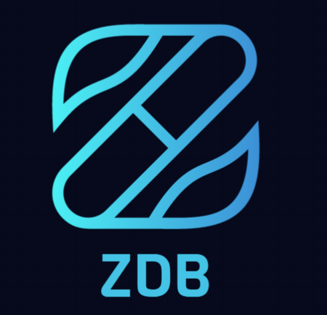

# ZDB


本项目是一款基于Java的开源的关系数据库管理系统，可以使用命令行工具管理数据库，在设计上借鉴了MySQL的具体实现，旨在通过“造轮子”的方式，深入理解数据库管理系统的运行机制。

# Feature
- 设计高效的缓存框架
- 实现多版本并发控制提高读性能（MVCC）
- 实现两种事务隔离级别（读提交和可重复读）
- 实现死锁检测与处理
- 实现简单的表和字段管理
- 实现基于 socket 的 server 和 client 通信

# Architecture

项目主要模块及依赖关系如下图：


- **事务模块：** 此模块负责数据库的事务管理，通过".xid"文件记录事务的状态。
- **数据模块：** 此模块负责对底层数据文件的读取并进一步包装为"DataItem"，供上层调用。此外，此模块还负责日志文件的管理。
- **版本模块：** 此模块负责数据的版本控制，实现了 MVCC 以消除读写阻塞，将数据进一步包装成"Entry"，供上层调用。
- **索引模块：** 此模块主要是通过建立索引树（B+树实现）优化查询效率。
- **表格模块：** 此模块主要是将“表格”、“字段”进行抽象，并对SQL进行解析。

# Installation

1. 克隆项目到本地
```shell
git clone https://github.com/Xudongenen/zdb.git
```
2. 创建数据文件夹
```shell
mkdir zdb_data
```
3. 创建数据库
```shell
mvn exec:java -Dexec.mainClass="com.zxd.zdb.backend.Launcher" -Dexec.args="-create ./zdb_data"
```
4. 启动数据库服务

```shell
mvn exec:java -Dexec.mainClass="com.zxd.zdb.backend.Launcher" -Dexec.args="-open ./zdb_data"
```

5. 启动客户端
```shell
mvn exec:java -Dexec.mainClass="com.zxd.zdb.client.Launcher"
```
